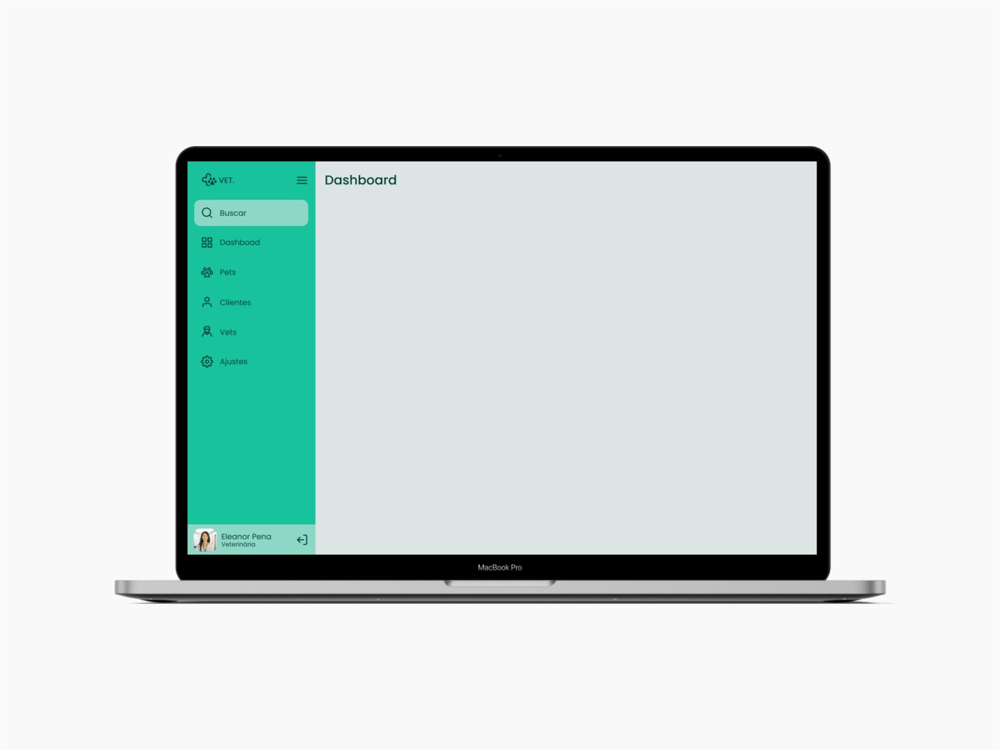

<h1 align="center"> Theme Switcher </h1>

Countdown é um projeto desafio proposto pela <a href="https://www.rocketseat.com.br/">Rocketseat</a>, que consiste em criar uma Sidebar. Quando o usuário clicar no ícone do menu isso deve fazer com que o estado da sidebar mude entre "aberto", mostrando ícones e texto e "fechado", mostrando apenas os ícones. 

  

 

## 🚀 Tecnologias

Esse projeto foi desenvolvido com as seguintes tecnologias:

- HTML e CSS
- JavaScript
- Git e Github
- Figma

## 💻 Projeto

- [Visite o projeto online](https://theusmm.github.io/sidebar/)

## 🔖 Layout

Você pode visualizar o layout do projeto através [DESSE LINK](https://www.figma.com/file/iOuqAlZvhAMkkfjCMFyc7Y/DD-%2F-Sidebar-Responsiva/duplicate). É necessário ter conta no [Figma](https://figma.com) para acessá-lo.

Feito com ♥ by Matheus MM. :wave: